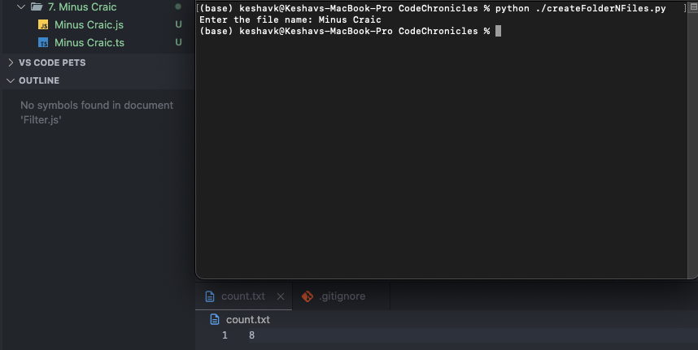

### Use case/Backstory:

- It felt repetitive when I was creating new folder & files while solving leetcode problems everyday & the urge to automate it kicked in.
- Use this to create TS, JS files within a folder all with the same name the user provides

### Description/Walk-through:

- After the script is run, it asks for the folder name (also uses the same name for files)
- It also increments the counter in a text file ('count.txt')
